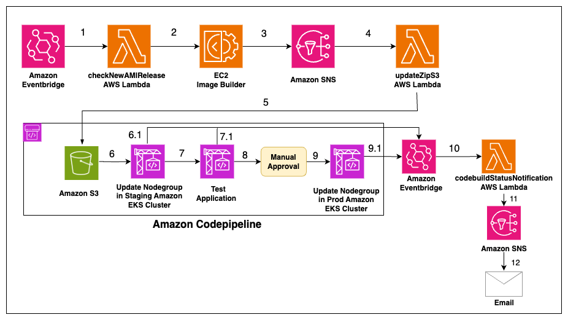

# Automating AL2023 custom hardened AMI updates for Amazon EKS managed nodes
Automating EKS Managed Nodegroup update for Custom Amazon Linux 2023 AMIs using EC2 Image Builder and Code Pipeline

## Blog Post: https://aws.amazon.com/blogs/containers/automating-al2023-custom-hardened-ami-updates-for-amazon-eks-managed-nodes/

## Solution Architecture

## Security

See [CONTRIBUTING](CONTRIBUTING.md#security-issue-notifications) for more information.

## License

This library is licensed under the MIT-0 License. See the LICENSE file.

